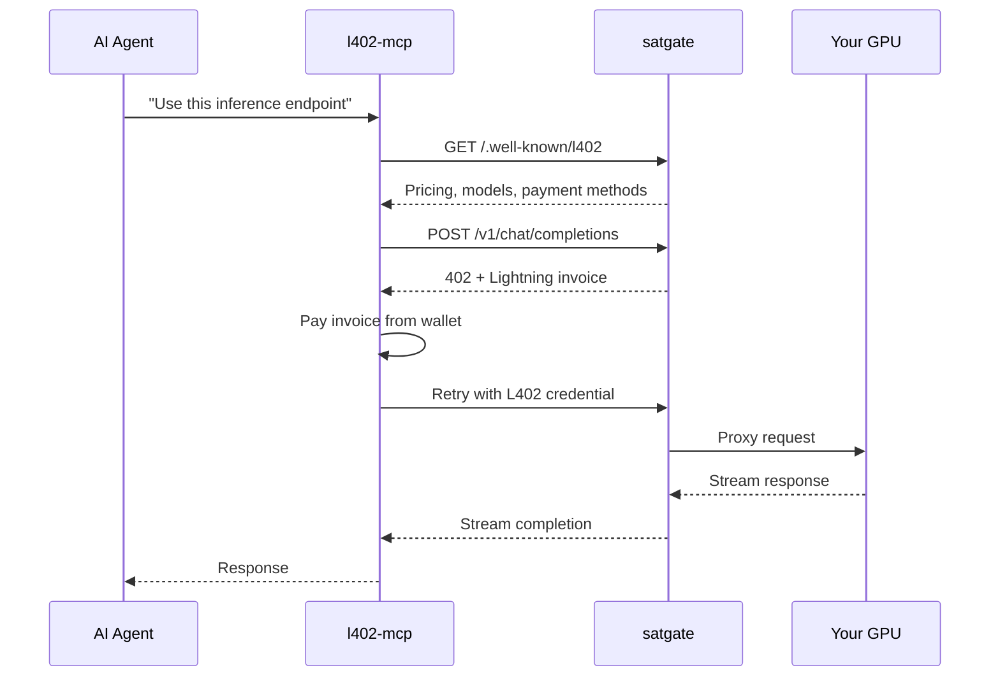
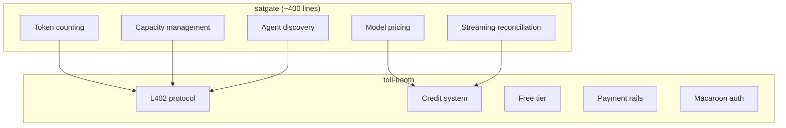
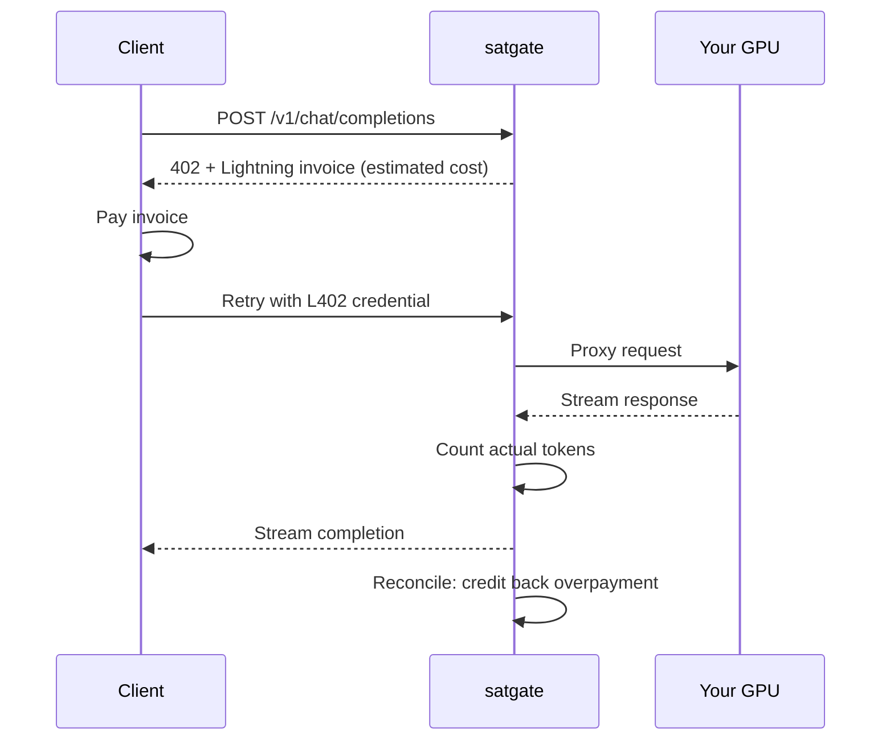

# satgate

[](./LICENSE)
[](https://primal.net/p/npub1mgvlrnf5hm9yf0n5mf9nqmvarhvxkc6remu5ec3vf8r0txqkuk7su0e7q2)
[](https://www.typescriptlang.org/)
[](https://nodejs.org/)

**Your GPU is burning money. Make it earn money.**

satgate sits in front of Ollama, vLLM, llama.cpp — any OpenAI-compatible backend — and turns it into a pay-per-token API. No accounts. No API keys. No Stripe. Clients pay per token, you earn sats before the response finishes streaming.


## Quick start

```bash
npx satgate --upstream http://localhost:11434
```

That's it. satgate auto-detects your models, starts accepting payments, and proxies inference requests. Clients pay per token, you earn sats.

---

## Try it live

A public instance is running at [satgate.trotters.dev](https://satgate.trotters.dev). Open it in a browser for the chat playground, or use curl:

```bash
# 250 sats of free usage per day per IP — after that you'll get a 402 + invoice
curl -s -w '\n%{http_code}\n' https://satgate.trotters.dev/v1/chat/completions \
  -H "Content-Type: application/json" \
  -d '{"model":"qwen3:0.6b","messages":[{"role":"user","content":"What is Bitcoin?"}]}'

# Check pricing
curl -s https://satgate.trotters.dev/.well-known/l402 | jq .

# Machine-readable description
curl -s https://satgate.trotters.dev/llms.txt
```

---

## The old way vs satgate

| | The old way | With satgate |
|---|---|---|
| **Sell GPU time** | Sign up for a marketplace (OpenRouter, Together). They set the price, take a cut, own the customer. | `npx satgate --upstream http://localhost:11434`. You set the price. You keep 100%. |
| **Handle billing** | Stripe account, KYC, usage tracking, invoices, chargebacks | Payments settle before the response finishes streaming. No accounts, no disputes. |
| **Serve AI agents** | OAuth flows, API key management, billing portals — none of which machines can use | Agents discover your endpoint, pay per token from their own wallet, no human in the loop. |
| **Price fairly** | Flat rate per request, regardless of whether it's 10 tokens or 10,000 | Actual tokens counted from the response. Overpayments credited back. |

---

## Built for machines

satgate doesn't just serve humans with `curl`. It's designed for AI agents that pay for their own resources.

Every satgate instance exposes three discovery endpoints — no auth required:

| Endpoint | Who reads it |
|---|---|
| `/.well-known/l402` | Machines — pricing, models, payment methods as structured JSON |
| `/llms.txt` | AI agents — plain-text description of what you're selling |
| `/openapi.json` | Code generators — full OpenAPI spec |

Pair with [l402-mcp](https://github.com/TheCryptoDonkey/l402-mcp) and an AI agent can autonomously discover your endpoint, check your prices, pay from its own wallet, and start prompting — no human involved.



---

## The secret

Everything you just saw — the payment gating, the multi-rail support, the credit system, the free tier, the macaroon credentials — that's not satgate. That's [toll-booth](https://github.com/TheCryptoDonkey/toll-booth).

satgate is ~400 lines of glue on top of toll-booth. It adds the AI-specific bits: token counting, model pricing, streaming reconciliation, capacity management. Everything else comes from the middleware.

**You could build your own satgate for your domain in an afternoon.**

Monetise a routing API. Gate a translation service. Sell weather data per request. toll-booth handles the payments — you just write the product logic.

→ [**See toll-booth**](https://github.com/TheCryptoDonkey/toll-booth)



---

## What satgate adds

- **Pay-per-token** — actual token count from the response, not estimated. Streaming and buffered.
- **Model-specific pricing** — 1 sat/1k for Llama, 5 sats/1k for DeepSeek. You set the rates.
- **Streaming reconciliation** — estimated charge upfront, reconciled to actual usage after. Overpayments credited back.
- **Capacity management** — limit concurrent inference requests to protect your GPU.
- **Auto-detect models** — queries your upstream on startup. No manual model list.
- **Four payment rails** — Lightning, Cashu ecash, NWC, and x402 stablecoins. Operator picks what to accept.
- **Instant public URL** — auto-spawns a Cloudflare tunnel. Your GPU is reachable from the internet in seconds.

---

## How it works



Charges are estimated upfront based on model pricing, then reconciled to actual token usage after the response completes. Operators are never short-changed — costs round up. Overpayments are credited to the client's balance for the next request.

---

## Configuration

Zero config works (just `--upstream`). For production, create `satgate.yaml`:

```yaml
upstream: http://localhost:11434
port: 3000
pricing:
  default: 1          # 1 sat per 1k tokens
  models:
    llama3: 1
    deepseek-r1: 5
freeTier:
  creditsPerDay: 250
capacity:
  maxConcurrent: 4
```

CLI flags > environment variables > config file > defaults.

---

## Get started

```bash
# Monetise your local Ollama
npx satgate --upstream http://localhost:11434

# Or point at any OpenAI-compatible backend
npx satgate --upstream http://your-vllm-server:8000
```

→ [**toll-booth**](https://github.com/TheCryptoDonkey/toll-booth) — the middleware that powers all of this. Build your own.
→ [**l402-mcp**](https://github.com/TheCryptoDonkey/l402-mcp) — give AI agents a wallet. Let them pay for your GPU.

---

Built by [@TheCryptoDonkey](https://github.com/TheCryptoDonkey).

- Lightning tips: `thedonkey@strike.me`
- Nostr: `npub1mgvlrnf5hm9yf0n5mf9nqmvarhvxkc6remu5ec3vf8r0txqkuk7su0e7q2`

---

[MIT](./LICENSE)
