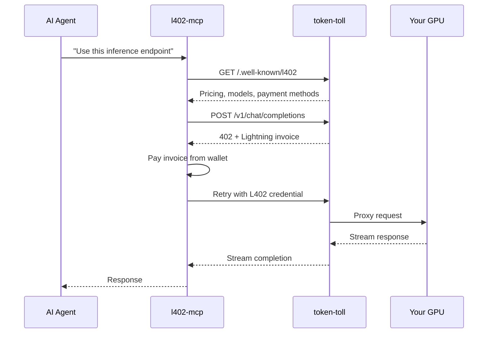
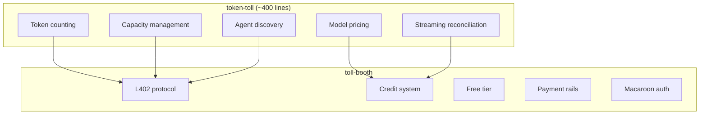
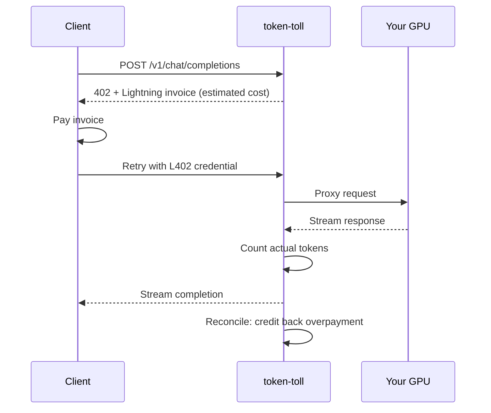

# README Messaging Design — token-toll + toll-booth

**Date:** 2026-03-13
**Status:** Draft
**Scope:** Rewrite token-toll README, minor updates to toll-booth README

---

## Context

token-toll is a production demonstration of toll-booth's capabilities that also earns real sats. The current READMEs are technically solid but undersell the vision, duplicate each other's messaging, and bury the most novel features (AI agent autonomy, the thin-glue architecture story).

## Design Principles

1. **toll-booth is the star, token-toll is the proof.** token-toll's README should impress people enough to click through to toll-booth.
2. **"Product with a secret" (Approach B).** Lead with token-toll as a compelling product. Halfway through, reveal that everything impressive is toll-booth under the hood — and you could build your own.
3. **Punchy and opinionated tone.** Strong claims, clear point of view. Like MISSION.md, not a corporate datasheet.
4. **No duplication.** Each README owns its own messaging. token-toll talks AI inference. toll-booth talks generic API monetisation.
5. **The pair must work as a funnel.** token-toll → "the secret" reveal → toll-booth → "build your own."

---

## token-toll README Structure

### Section 1: The Hook

Replace the current tagline with an emotional opener:

> **Your GPU is burning money. Make it earn money.**
>
> token-toll sits in front of Ollama, vLLM, llama.cpp — any OpenAI-compatible backend — and turns it into a pay-per-token API. No accounts. No API keys. No Stripe. Clients pay per token, you earn sats before the response finishes streaming.

Immediately followed by the quick start one-liner:

```bash
npx token-toll --upstream http://localhost:11434
```

One-line description: "That's it. token-toll auto-detects your models, starts accepting payments, and proxies inference requests. Clients pay per token, you earn sats."

**Visual asset: VHS terminal recording** placed between the hook and quick start (or immediately after). Shows:
- `npx token-toll --upstream http://localhost:11434` starting up
- Pretty logs: models detected, server ready
- A request arriving, 402 challenge issued, payment landing, inference streaming
- Sats-earned confirmation in logs

The VHS recording is the first visual impression. It should feel like watching money arrive.

### Section 2: Old Way vs token-toll

AI-inference-specific comparison table. Differentiates from toll-booth's generic API table.

| | The old way | With token-toll |
|---|---|---|
| **Sell GPU time** | Sign up for a marketplace (OpenRouter, Together). They set the price, take a cut, own the customer. | `npx token-toll --upstream http://localhost:11434`. You set the price. You keep 100%. |
| **Handle billing** | Stripe account, KYC, usage tracking, invoices, chargebacks | Payments settle before the response finishes streaming. No accounts, no disputes. |
| **Serve AI agents** | OAuth flows, API key management, billing portals — none of which machines can use | Agents discover your endpoint, pay per token from their own wallet, no human in the loop. |
| **Price fairly** | Flat rate per request, regardless of whether it's 10 tokens or 10,000 | Actual tokens counted from the response. Overpayments credited back. |

### Section 3: Built for Machines

Promote AI agent story from its current burial at line 118 to a prominent early position. This is the differentiator.

> token-toll doesn't just serve humans with `curl`. It's designed for AI agents that pay for their own resources.
>
> Every token-toll instance exposes three discovery endpoints — no auth required:
>
> | Endpoint | Who reads it |
> |---|---|
> | `/.well-known/l402` | Machines — pricing, models, payment methods as structured JSON |
> | `/llms.txt` | AI agents — plain-text description of what you're selling |
> | `/openapi.json` | Code generators — full OpenAPI spec |
>
> Pair with [l402-mcp](https://github.com/TheCryptoDonkey/l402-mcp) and an AI agent can autonomously discover your endpoint, check your prices, pay from its own wallet, and start prompting — no human involved.

**Visual asset: Mermaid sequence diagram** showing the autonomous agent flow:



**Visual asset: VHS recording (optional, could be same as hero or separate).** Split terminal: left = AI agent via l402-mcp discovering and paying, right = token-toll logs showing payment arrive and request proxy through.

### Section 4: The Secret (toll-booth reveal)

The heart of Approach B. Comes after the reader is already impressed.

> ## The secret
>
> Everything you just saw — the payment gating, the multi-rail support, the credit system, the free tier, the macaroon credentials — that's not token-toll. That's [toll-booth](https://github.com/TheCryptoDonkey/toll-booth).
>
> token-toll is ~400 lines of glue on top of toll-booth. It adds the AI-specific bits: token counting, model pricing, streaming reconciliation, capacity management. Everything else comes from the middleware.
>
> **You could build your own token-toll for your domain in an afternoon.**
>
> Monetise a routing API. Gate a translation service. Sell weather data per request. toll-booth handles the payments — you just write the product logic.
>
> → [**See toll-booth**](https://github.com/TheCryptoDonkey/toll-booth)

**Visual asset: Mermaid architecture diagram** showing the layering:



### Section 5: What token-toll Adds

Seven bullets covering only what token-toll itself provides. Everything toll-booth gives you is covered in "The secret."

- **Pay-per-token** — actual token count from the response, not estimated. Streaming and buffered.
- **Model-specific pricing** — 1 sat/1k for Llama, 5 sats/1k for DeepSeek. You set the rates.
- **Streaming reconciliation** — estimated charge upfront, reconciled to actual usage after. Overpayments credited back.
- **Capacity management** — limit concurrent inference requests to protect your GPU.
- **Auto-detect models** — queries your upstream on startup. No manual model list.
- **Four payment rails** — Lightning, Cashu ecash, NWC, and x402 stablecoins. Operator picks what to accept. *(Note: confirm x402 is shipped in token-toll before publishing. If not, say "three today, x402 coming.")*
- **Instant public URL** — auto-spawns a Cloudflare tunnel. Your GPU is reachable from the internet in seconds.

### Section 6: How it Works

Mermaid sequence diagram replacing the current text-art:



Short paragraph: "Charges are estimated upfront based on model pricing, then reconciled to actual token usage after the response completes. Operators are never short-changed — costs round up. Overpayments are credited to the client's balance for the next request."

### Section 7: Configuration

Trimmed to just the YAML example. Full reference linked out.

> Zero config works (just `--upstream`). For production, create `token-toll.yaml`:
>
> ```yaml
> upstream: http://localhost:11434
> port: 3000
> pricing:
>   default: 1          # 1 sat per 1k tokens
>   models:
>     llama3: 1
>     deepseek-r1: 5
> freeTier:
>   requestsPerDay: 5
> capacity:
>   maxConcurrent: 4
> ```
>
> CLI flags > environment variables > config file > defaults. See [full configuration reference](docs/configuration.md) for all options. *(Note: confirm `docs/configuration.md` exists before publishing. If not, either create it or link to the config section of this README instead.)*

### Section 8: Get Started (action close)

Ends with action, then the two links that matter, then clean sign-off.

> ```bash
> # Monetise your local Ollama
> npx token-toll --upstream http://localhost:11434
>
> # Or point at any OpenAI-compatible backend
> npx token-toll --upstream http://your-vllm-server:8000
> ```
>
> → [**toll-booth**](https://github.com/TheCryptoDonkey/toll-booth) — the middleware that powers all of this. Build your own.
> → [**l402-mcp**](https://github.com/TheCryptoDonkey/l402-mcp) — give AI agents a wallet. Let them pay for your GPU.

Badges, support links (Lightning tips, Nostr), and licence at the bottom.

### Sections Removed

- **"Features" (10 bullets)** — replaced by "What token-toll adds" (7 bullets, AI-specific only)
- **"How it works" text-art diagram** — replaced by mermaid
- **"AI agent compatibility"** — promoted and expanded into "Built for machines"
- **"Programmatic usage"** — cut from README, can live in docs/ if needed
- **"Ecosystem" table** — replaced by "The secret" narrative and the action close links
- **Duplicate payment flow explanation** — toll-booth owns this now

---

## toll-booth README Changes

### Change 1: New "See it in production" Section

Insert after the "Five zeroes" section:

> ## See it in production
>
> [**token-toll**](https://github.com/TheCryptoDonkey/token-toll) is a pay-per-token AI inference proxy built on toll-booth. It monetises any OpenAI-compatible endpoint — Ollama, vLLM, llama.cpp — with one command. Token counting, model pricing, streaming reconciliation, capacity management. Everything else — payments, credits, free tier, macaroon auth — is toll-booth.
>
> ~400 lines of product logic on top of the middleware. That's what "monetise any API with one line of code" looks like in practice.

### Change 2: Ecosystem Table Update

Update the token-toll entry to reflect its role:

| Project | Role |
|---------|------|
| **[toll-booth](https://github.com/TheCryptoDonkey/toll-booth)** | **Payment-rail agnostic HTTP 402 middleware** |
| [token-toll](https://github.com/TheCryptoDonkey/token-toll) | Production showcase — pay-per-token AI inference proxy (~400 lines on toll-booth) |
| [l402-mcp](https://github.com/TheCryptoDonkey/l402-mcp) | Client side — AI agents discover, pay, and consume L402 APIs |

### Change 3: No Other Changes

The rest of toll-booth's README is working well: code examples, Lightning backends table, Aperture comparison, x402 positioning, payment flow diagram, production checklist. No modifications.

---

## Visual Assets Summary

| Asset | Type | Location | Description |
|-------|------|----------|-------------|
| Hero recording | VHS GIF | token-toll README, top | Startup → request → payment → inference → sats earned |
| Agent flow | Mermaid sequence | token-toll "Built for machines" | AI agent → l402-mcp → token-toll → GPU autonomous flow |
| Architecture layers | Mermaid graph | token-toll "The secret" | toll-booth foundation with token-toll glue on top |
| Payment flow | Mermaid sequence | token-toll "How it works" | Client → 402 → pay → stream → reconcile |
| Agent demo (optional) | VHS GIF | token-toll "Built for machines" | Split terminal: agent paying / token-toll logs |

VHS recordings require a working token-toll instance with a mock Lightning backend. These should be produced after the README text is finalised, so the recording matches the documented experience.

---

## Success Criteria

1. Someone landing on token-toll's README thinks "I want to run this" within 10 seconds.
2. By "The secret" section, they click through to toll-booth thinking "I could build my own."
3. The toll-booth README confirms that impression and gives them the tools to start.
4. No duplicated messaging between the two READMEs.
5. The tone is opinionated and confident throughout — not corporate, not apologetic.
